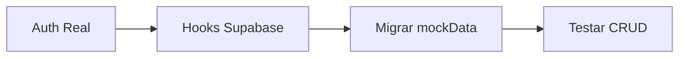
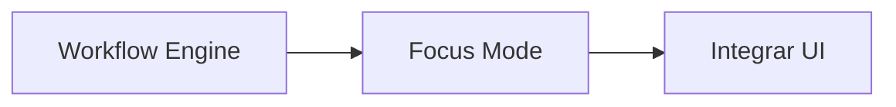
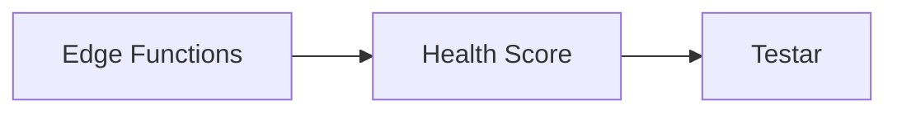

# 📋 Pendências de Implementação — Velocity Agency OS (v3)

**Data de referência:** 09 jan 2026  
**Documento PDR:** `velocity_agency_os_PDR_v1_0.md`  
**Conferência:** `conferencia.md`  
**Última atualização:** 09 jan 2026 18:47

---

## 1. Status Executivo Atualizado

### Dashboard de Progresso

| Área | Progresso | Arquivos Relevantes |
|------|-----------|---------------------|
| **UI Components** | ✅ 100% | `/src/components/ui/` (51 arquivos) |
| **Layout/Navegação** | ✅ 100% | `/src/components/layout/` (4 arquivos) |
| **Páginas Agência** | ✅ 100% | `/src/pages/` (8 arquivos) |
| **Portal Cliente** | ⚠️ 80% | `/src/pages/client/` (4 arquivos) |
| **Workspace 10 Abas** | ✅ 100% | `/src/components/workspace/` (12 arquivos) |
| **Database Schema** | ✅ 95% | `/supabase/migrations/` (21 tabelas) |
| **RLS Policies** | ✅ 100% | Migration SQL (23 policies) |
| **Seed Data** | ✅ 100% | `/supabase/seeds/demo_data.sql` |
| **Auth Real** | ❌ 0% | `Login.tsx` usa mock |
| **Hooks Supabase** | ❌ 0% | Não implementados |
| **Workflow Engine** | ❌ 0% | Lógica de gates não existe |
| **Focus Mode** | ❌ 0% | Componente não existe |
| **Edge Functions** | ❌ 0% | Pasta não existe |
| **n8n Integrações** | ❌ 0% | Não configurado |

**TOTAL ESTIMADO:** ~55%

---

## 2. O Que Foi Implementado (Detalhado)

### 2.1 Frontend - UI Base ✅

| Item | Quantidade | Localização |
|------|------------|-------------|
| Componentes shadcn/ui | 51 | `/src/components/ui/` |
| Componentes Layout | 4 | `/src/components/layout/` |
| Componentes Dashboard | 4 | `/src/components/dashboard/` |
| Componentes Workspace | 12 | `/src/components/workspace/` |
| Componentes Shared | 2 | `/src/components/shared/` |
| Páginas Agência | 8 | `/src/pages/` |
| Páginas Portal Cliente | 4 | `/src/pages/client/` |
| Páginas Auth | 2 | `/src/pages/auth/` |

### 2.2 Workspace - 10 Abas ✅

| Aba | Componente | Funcionalidades Implementadas |
|-----|------------|-------------------------------|
| Overview | `ClientWorkspace.tsx` | KPIs, Health, Gates, Tarefas pendentes |
| Workflows | `WorkflowTimeline.tsx` | Timeline visual, ModuleCard, GateStatus |
| Strategy | `StrategyTab.tsx` | 4 seções colapsáveis (QFD, Kickoff, Diagnóstico, Blueprint) |
| Operations | `OperationsTab.tsx` | Kanban Board (4 colunas), TaskCard, Sprint history |
| CRM | `CRMTab.tsx` | Pipeline visual (6 estágios), LeadCard, Templates WhatsApp |
| Content | `ContentTab.tsx` | Grid de criativos, CreativeCard, Calendário editorial |
| Media | `MediaTab.tsx` | CampaignCard, KPIs (CPL/CPA), Budget overview |
| Data | `DataTab.tsx` | Tracking checklist, Status de configuração, Links dashboards |
| Approvals | `ApprovalsTab.tsx` | Lista pendentes + SLA, Preview, Histórico, Ações |
| Assets | `AssetsTab.tsx` | Inventário, Checklist de acessos, Upload UI (mock) |
| Notes | `NotesTab.tsx` | Timeline, Filtro por tipo, Busca, NoteCard |

### 2.3 Backend - Supabase ✅

| Item | Status | Arquivo |
|------|--------|---------|
| Cliente tipado | ✅ | `/src/lib/supabase.ts` |
| Tipos TypeScript | ✅ | `/src/types/database.ts` |
| 21 Tabelas | ✅ | Migration SQL |
| 16 Enums | ✅ | Migration SQL |
| 28 Indexes | ✅ | Migration SQL |
| 5 Triggers | ✅ | Migration SQL |
| 23 RLS Policies | ✅ | Migration SQL |
| Função helper | ✅ | `user_agency_id()` |
| Seed data | ✅ | `/supabase/seeds/demo_data.sql` |

---

## 3. O Que NÃO Foi Implementado (Roadmap)

### 🔴 P0 — Crítico (Semana 1)

#### 3.1 Autenticação Real

**Objetivo:** Integrar Login.tsx com Supabase Auth

**Arquivos a modificar:**
- `/src/pages/auth/Login.tsx`
- `/src/pages/auth/ResetPassword.tsx`
- `/src/App.tsx` (proteção de rotas)

**Código de referência:**

```typescript
// Login.tsx - Substituir o mock atual por:
import { supabase } from '@/lib/supabase';

const handleLogin = async (email: string, password: string) => {
  const { data, error } = await supabase.auth.signInWithPassword({
    email,
    password
  });
  
  if (error) {
    toast({ title: 'Erro', description: error.message, variant: 'destructive' });
    return;
  }
  
  navigate('/');
};
```

```typescript
// App.tsx - Adicionar AuthContext:
import { useEffect, useState } from 'react';
import { supabase } from '@/lib/supabase';
import type { User } from '@supabase/supabase-js';

function App() {
  const [user, setUser] = useState<User | null>(null);
  const [loading, setLoading] = useState(true);

  useEffect(() => {
    supabase.auth.getSession().then(({ data: { session } }) => {
      setUser(session?.user ?? null);
      setLoading(false);
    });

    const { data: { subscription } } = supabase.auth.onAuthStateChange(
      (_event, session) => {
        setUser(session?.user ?? null);
      }
    );

    return () => subscription.unsubscribe();
  }, []);

  if (loading) return <LoadingScreen />;

  return (
    <BrowserRouter>
      <Routes>
        {/* Rotas públicas */}
        <Route path="/login" element={!user ? <Login /> : <Navigate to="/" />} />
        
        {/* Rotas protegidas */}
        <Route path="/" element={user ? <Index /> : <Navigate to="/login" />} />
        {/* ... outras rotas */}
      </Routes>
    </BrowserRouter>
  );
}
```

**Checklist:**
- [ ] Implementar `handleLogin` com Supabase
- [ ] Implementar `handleLogout` 
- [ ] Implementar `handleResetPassword`
- [ ] Criar `AuthContext` para estado global
- [ ] Proteger rotas da agência
- [ ] Proteger rotas do portal cliente
- [ ] Testar login/logout
- [ ] Testar reset password

---

#### 3.2 Hooks Supabase

**Objetivo:** Criar hooks para cada domínio usando TanStack Query

**Arquivos a criar:**
- `/src/hooks/useClients.ts`
- `/src/hooks/useTasks.ts`
- `/src/hooks/useWorkflows.ts`
- `/src/hooks/useLeads.ts`
- `/src/hooks/useApprovals.ts`
- `/src/hooks/useAssets.ts`
- `/src/hooks/useCampaigns.ts`
- `/src/hooks/useCreatives.ts`
- `/src/hooks/useKPIs.ts`

**Template de hook:**

```typescript
// /src/hooks/useClients.ts
import { useQuery, useMutation, useQueryClient } from '@tanstack/react-query';
import { supabase } from '@/lib/supabase';
import type { Database } from '@/types/database';

type Client = Database['public']['Tables']['clients']['Row'];
type ClientInsert = Database['public']['Tables']['clients']['Insert'];
type ClientUpdate = Database['public']['Tables']['clients']['Update'];

// Query: Listar todos
export function useClients() {
  return useQuery({
    queryKey: ['clients'],
    queryFn: async () => {
      const { data, error } = await supabase
        .from('clients')
        .select('*, workspaces(*)')
        .order('created_at', { ascending: false });
      
      if (error) throw error;
      return data;
    }
  });
}

// Query: Buscar por ID
export function useClient(id: string) {
  return useQuery({
    queryKey: ['clients', id],
    queryFn: async () => {
      const { data, error } = await supabase
        .from('clients')
        .select(`
          *,
          workspaces (
            *,
            workflows (
              *,
              modules (*, steps (*), gates (*))
            )
          )
        `)
        .eq('id', id)
        .single();
      
      if (error) throw error;
      return data;
    },
    enabled: !!id
  });
}

// Mutation: Criar
export function useCreateClient() {
  const queryClient = useQueryClient();
  
  return useMutation({
    mutationFn: async (client: ClientInsert) => {
      const { data, error } = await supabase
        .from('clients')
        .insert(client)
        .select()
        .single();
      
      if (error) throw error;
      return data;
    },
    onSuccess: () => {
      queryClient.invalidateQueries({ queryKey: ['clients'] });
    }
  });
}

// Mutation: Atualizar
export function useUpdateClient() {
  const queryClient = useQueryClient();
  
  return useMutation({
    mutationFn: async ({ id, ...updates }: ClientUpdate & { id: string }) => {
      const { data, error } = await supabase
        .from('clients')
        .update(updates)
        .eq('id', id)
        .select()
        .single();
      
      if (error) throw error;
      return data;
    },
    onSuccess: (data) => {
      queryClient.invalidateQueries({ queryKey: ['clients'] });
      queryClient.invalidateQueries({ queryKey: ['clients', data.id] });
    }
  });
}

// Mutation: Deletar
export function useDeleteClient() {
  const queryClient = useQueryClient();
  
  return useMutation({
    mutationFn: async (id: string) => {
      const { error } = await supabase
        .from('clients')
        .delete()
        .eq('id', id);
      
      if (error) throw error;
    },
    onSuccess: () => {
      queryClient.invalidateQueries({ queryKey: ['clients'] });
    }
  });
}
```

**Checklist por hook:**

| Hook | Query List | Query Single | Create | Update | Delete |
|------|------------|--------------|--------|--------|--------|
| useClients | [ ] | [ ] | [ ] | [ ] | [ ] |
| useTasks | [ ] | [ ] | [ ] | [ ] | [ ] |
| useWorkflows | [ ] | [ ] | [ ] | [ ] | [ ] |
| useLeads | [ ] | [ ] | [ ] | [ ] | [ ] |
| useApprovals | [ ] | [ ] | [ ] | [ ] | [ ] |
| useAssets | [ ] | [ ] | [ ] | [ ] | [ ] |
| useCampaigns | [ ] | [ ] | [ ] | [ ] | [ ] |
| useCreatives | [ ] | [ ] | [ ] | [ ] | [ ] |
| useKPIs | [ ] | [ ] | [ ] | N/A | N/A |

---

### 🟠 P1 — Importante (Semana 2-3)

#### 3.3 Workflow Engine

**Objetivo:** Implementar lógica de validação de Gates (DoD)

**Arquivos a criar:**
- `/src/lib/workflowEngine.ts`
- `/src/hooks/useWorkflowEngine.ts`

**Código de referência:**

```typescript
// /src/lib/workflowEngine.ts

import { supabase } from '@/lib/supabase';
import type { Database } from '@/types/database';

type Gate = Database['public']['Tables']['gates']['Row'];
type Step = Database['public']['Tables']['steps']['Row'];
type ChecklistItem = Database['public']['Tables']['checklist_items']['Row'];

interface GateValidationResult {
  passed: boolean;
  failedConditions: string[];
}

/**
 * Valida se um Gate (DoD) foi cumprido
 * 
 * dod_config exemplo:
 * {
 *   "requires": {
 *     "all_steps_completed": true,
 *     "all_required_checklist_items": true,
 *     "specific_fields": ["meta_numerica", "persona", "oferta"]
 *   }
 * }
 */
export async function validateGate(gateId: string): Promise<GateValidationResult> {
  // 1. Buscar o gate e seu módulo
  const { data: gate, error: gateError } = await supabase
    .from('gates')
    .select(`
      *,
      module:modules (
        *,
        steps (
          *,
          checklist_items (*)
        )
      )
    `)
    .eq('id', gateId)
    .single();

  if (gateError || !gate) {
    throw new Error('Gate não encontrado');
  }

  const failedConditions: string[] = [];
  const config = gate.dod_config as any;
  const steps = gate.module?.steps || [];

  // 2. Verificar steps completados
  if (config?.requires?.all_steps_completed) {
    const incompleteSteps = steps.filter(s => s.status !== 'completed');
    if (incompleteSteps.length > 0) {
      failedConditions.push(
        `${incompleteSteps.length} steps não concluídos: ${incompleteSteps.map(s => s.name).join(', ')}`
      );
    }
  }

  // 3. Verificar checklist items obrigatórios
  if (config?.requires?.all_required_checklist_items) {
    const allItems = steps.flatMap(s => s.checklist_items || []);
    const requiredIncomplete = allItems.filter(
      (item: ChecklistItem) => item.is_required && !item.is_completed
    );
    if (requiredIncomplete.length > 0) {
      failedConditions.push(
        `${requiredIncomplete.length} itens obrigatórios não marcados`
      );
    }
  }

  // 4. Atualizar status do gate
  const passed = failedConditions.length === 0;
  await supabase
    .from('gates')
    .update({
      status: passed ? 'passed' : 'failed',
      validated_at: new Date().toISOString()
    })
    .eq('id', gateId);

  return { passed, failedConditions };
}

/**
 * Verifica se pode avançar para o próximo módulo
 */
export async function canAdvanceModule(moduleId: string): Promise<boolean> {
  const { data: gates } = await supabase
    .from('gates')
    .select('*')
    .eq('module_id', moduleId);

  return gates?.every(g => g.status === 'passed') ?? false;
}

/**
 * Marca step como concluído e valida gate
 */
export async function completeStep(stepId: string): Promise<{ success: boolean; gateResult?: GateValidationResult }> {
  // 1. Atualizar step
  const { data: step, error } = await supabase
    .from('steps')
    .update({ 
      status: 'completed',
      completed_at: new Date().toISOString()
    })
    .eq('id', stepId)
    .select('*, module:modules!inner(*)')
    .single();

  if (error) throw error;

  // 2. Buscar gate do módulo
  const { data: gate } = await supabase
    .from('gates')
    .select('id')
    .eq('module_id', step.module_id)
    .single();

  // 3. Se tiver gate, validar
  if (gate) {
    const gateResult = await validateGate(gate.id);
    return { success: true, gateResult };
  }

  return { success: true };
}
```

**Checklist Workflow Engine:**
- [ ] Função `validateGate()`
- [ ] Função `canAdvanceModule()`
- [ ] Função `completeStep()`
- [ ] Função `blockStep()`
- [ ] Hook `useWorkflowEngine()`
- [ ] Integrar em `ModuleCard.tsx`
- [ ] Integrar em `GateStatus.tsx`
- [ ] Testar fluxo completo

---

#### 3.4 Focus Mode (FR-009)

**Objetivo:** Criar modo de execução focado por step

**Arquivos a criar:**
- `/src/components/workspace/FocusModeDrawer.tsx`

**Código de referência:**

```typescript
// /src/components/workspace/FocusModeDrawer.tsx

import { useState } from 'react';
import { Sheet, SheetContent, SheetHeader, SheetTitle } from '@/components/ui/sheet';
import { Button } from '@/components/ui/button';
import { Checkbox } from '@/components/ui/checkbox';
import { Progress } from '@/components/ui/progress';
import { Badge } from '@/components/ui/badge';
import { Input } from '@/components/ui/input';
import { Textarea } from '@/components/ui/textarea';
import { useToast } from '@/hooks/use-toast';
import { Clock, CheckCircle2, AlertCircle, Link2, FileText } from 'lucide-react';
import type { Database } from '@/types/database';

type Step = Database['public']['Tables']['steps']['Row'];
type ChecklistItem = Database['public']['Tables']['checklist_items']['Row'];

interface FocusModeDrawerProps {
  open: boolean;
  onOpenChange: (open: boolean) => void;
  step: Step & { checklist_items: ChecklistItem[] };
  onComplete: (stepId: string) => Promise<void>;
}

export function FocusModeDrawer({ 
  open, 
  onOpenChange, 
  step,
  onComplete 
}: FocusModeDrawerProps) {
  const { toast } = useToast();
  const [loading, setLoading] = useState(false);
  
  const requiredItems = step.checklist_items.filter(i => i.is_required);
  const completedRequired = requiredItems.filter(i => i.is_completed);
  const progress = requiredItems.length > 0 
    ? (completedRequired.length / requiredItems.length) * 100 
    : 0;
  
  const canComplete = completedRequired.length === requiredItems.length;

  const handleComplete = async () => {
    if (!canComplete) {
      toast({
        title: 'Itens pendentes',
        description: 'Complete todos os itens obrigatórios antes de concluir.',
        variant: 'destructive'
      });
      return;
    }
    
    setLoading(true);
    try {
      await onComplete(step.id);
      toast({ title: 'Step concluído!', variant: 'default' });
      onOpenChange(false);
    } catch (error) {
      toast({
        title: 'Erro',
        description: 'Não foi possível concluir o step.',
        variant: 'destructive'
      });
    } finally {
      setLoading(false);
    }
  };

  return (
    <Sheet open={open} onOpenChange={onOpenChange}>
      <SheetContent side="right" className="w-full sm:max-w-lg overflow-y-auto">
        <SheetHeader className="space-y-4">
          <div className="flex items-center justify-between">
            <SheetTitle className="text-xl">{step.name}</SheetTitle>
            <Badge variant={step.sla_hours && step.sla_hours < 24 ? 'destructive' : 'secondary'}>
              <Clock className="w-3 h-3 mr-1" />
              SLA: {step.sla_hours}h
            </Badge>
          </div>
          
          {step.description && (
            <p className="text-sm text-muted-foreground">{step.description}</p>
          )}
          
          <Progress value={progress} className="h-2" />
          <p className="text-xs text-muted-foreground">
            {completedRequired.length} de {requiredItems.length} itens obrigatórios
          </p>
        </SheetHeader>

        <div className="mt-6 space-y-6">
          {/* Checklist Obrigatório */}
          <section>
            <h3 className="font-semibold text-sm mb-3 flex items-center gap-2">
              <AlertCircle className="w-4 h-4 text-amber-500" />
              Obrigatório
            </h3>
            <div className="space-y-3">
              {requiredItems.map(item => (
                <div key={item.id} className="flex items-start gap-3 p-3 bg-muted/50 rounded-lg">
                  <Checkbox 
                    id={item.id} 
                    checked={item.is_completed}
                    // onCheckedChange → chamar mutation para atualizar
                  />
                  <label htmlFor={item.id} className="text-sm flex-1 cursor-pointer">
                    {item.name}
                  </label>
                </div>
              ))}
            </div>
          </section>

          {/* Checklist Opcional */}
          {step.checklist_items.filter(i => !i.is_required).length > 0 && (
            <section>
              <h3 className="font-semibold text-sm mb-3 flex items-center gap-2">
                <CheckCircle2 className="w-4 h-4 text-muted-foreground" />
                Opcional
              </h3>
              <div className="space-y-3">
                {step.checklist_items.filter(i => !i.is_required).map(item => (
                  <div key={item.id} className="flex items-start gap-3 p-3 bg-muted/30 rounded-lg">
                    <Checkbox id={item.id} checked={item.is_completed} />
                    <label htmlFor={item.id} className="text-sm flex-1 cursor-pointer">
                      {item.name}
                    </label>
                  </div>
                ))}
              </div>
            </section>
          )}

          {/* Evidências */}
          <section>
            <h3 className="font-semibold text-sm mb-3 flex items-center gap-2">
              <Link2 className="w-4 h-4" />
              Evidências (links, arquivos)
            </h3>
            <Input placeholder="Cole um link aqui..." className="mb-2" />
            <Textarea placeholder="Notas adicionais..." rows={3} />
          </section>
        </div>

        {/* Ações */}
        <div className="mt-8 flex gap-3">
          <Button variant="outline" className="flex-1" onClick={() => onOpenChange(false)}>
            Fechar
          </Button>
          <Button 
            className="flex-1" 
            disabled={!canComplete || loading}
            onClick={handleComplete}
          >
            {loading ? 'Salvando...' : 'Concluir Step'}
          </Button>
        </div>
      </SheetContent>
    </Sheet>
  );
}
```

**Checklist Focus Mode:**
- [ ] Componente `FocusModeDrawer.tsx`
- [ ] Checklist interativo com toggles
- [ ] Campos de evidência (links, arquivos)
- [ ] Progress bar de conclusão
- [ ] Botão concluir bloqueante
- [ ] Integrar em `WorkflowTimeline.tsx`
- [ ] Integrar com Workflow Engine

---

### 🟡 P2 — Médio Prazo (Semana 3-4)

#### 3.5 Edge Functions

**Objetivo:** Criar funções serverless para automação

**Pasta a criar:** `/supabase/functions/`

**Funções necessárias:**

```
supabase/functions/
├── ingest/
│   └── index.ts         # Receber métricas via webhook
├── recompute-health/
│   └── index.ts         # Calcular health score
├── create-weekly-sprint/
│   └── index.ts         # Criar sprint toda segunda
└── notify-sla/
    └── index.ts         # Notificar SLA vencendo
```

**Template:**

```typescript
// supabase/functions/ingest/index.ts

import "jsr:@supabase/functions-js/edge-runtime.d.ts";
import { createClient } from 'jsr:@supabase/supabase-js@2';

Deno.serve(async (req: Request) => {
  try {
    const supabase = createClient(
      Deno.env.get('SUPABASE_URL')!,
      Deno.env.get('SUPABASE_SERVICE_ROLE_KEY')!
    );

    const { event_id, agency_id, client_id, type, data } = await req.json();

    // Validar payload
    if (!agency_id || !client_id || !type) {
      return new Response(
        JSON.stringify({ error: 'Missing required fields' }),
        { status: 400, headers: { 'Content-Type': 'application/json' } }
      );
    }

    // Processar por tipo
    switch (type) {
      case 'metrics_ingest':
        await handleMetricsIngest(supabase, client_id, data);
        break;
      case 'lead_ingest':
        await handleLeadIngest(supabase, client_id, data);
        break;
      default:
        throw new Error(`Unknown type: ${type}`);
    }

    // Registrar no audit log
    await supabase.from('audit_logs').insert({
      agency_id,
      action: `edge_function:${type}`,
      entity_type: 'ingest',
      entity_id: event_id,
      new_data: data
    });

    return new Response(
      JSON.stringify({ success: true }),
      { headers: { 'Content-Type': 'application/json' } }
    );
  } catch (error) {
    return new Response(
      JSON.stringify({ error: error.message }),
      { status: 500, headers: { 'Content-Type': 'application/json' } }
    );
  }
});

async function handleMetricsIngest(supabase, clientId, data) {
  // Inserir KPI values
  const { kpi_key, value, period_start, period_end } = data;
  
  // Buscar kpi_id
  const { data: kpi } = await supabase
    .from('kpi_definitions')
    .select('id')
    .eq('key', kpi_key)
    .single();

  if (kpi) {
    await supabase.from('kpi_values').insert({
      client_id: clientId,
      kpi_id: kpi.id,
      value,
      period_start,
      period_end,
      source: 'webhook'
    });
  }
}

async function handleLeadIngest(supabase, clientId, data) {
  await supabase.from('crm_leads').insert({
    client_id: clientId,
    name: data.name,
    phone: data.phone,
    email: data.email,
    source: data.source || 'webhook',
    stage: 'new'
  });
}
```

**Checklist Edge Functions:**
- [ ] Criar pasta `/supabase/functions/`
- [ ] Função `ingest` — receber webhooks
- [ ] Função `recompute-health` — calcular health
- [ ] Função `create-weekly-sprint` — sprint automático
- [ ] Função `notify-sla` — notificar SLA
- [ ] Configurar CORS
- [ ] Deploy no Supabase Dashboard
- [ ] Testar via Postman

---

#### 3.6 Health Score

**Objetivo:** Implementar cálculo automático de health score

**Regras do PDR §13.3:**

```typescript
// /src/lib/healthScore.ts

import { supabase } from '@/lib/supabase';

type HealthStatus = 'ok' | 'warn' | 'risk';

interface HealthSignals {
  slaCompliance: number;       // % de SLAs cumpridos
  blockedGates: number;        // Qtd gates bloqueados
  gateDaysBlocked: number;     // Dias maior gate bloqueado
  leadsChange: number;         // % mudança leads vs média 4 semanas
  showRate: number;            // Show rate atual
  showRateMeta: number;        // Meta show rate
  daysWithoutApproval: number; // Dias sem aprovação do cliente
}

export function calculateHealthStatus(signals: HealthSignals): HealthStatus {
  // RISK se:
  // - leads caem > 30% vs média
  // - show rate < meta por 2 semanas
  // - cliente sem aprovar por 7 dias
  if (
    signals.leadsChange < -30 ||
    signals.showRate < signals.showRateMeta * 0.8 ||
    signals.daysWithoutApproval >= 7
  ) {
    return 'risk';
  }

  // WARN se:
  // - SLA compliance < 80%
  // - gate crítico bloqueado > 3 dias
  if (
    signals.slaCompliance < 80 ||
    signals.gateDaysBlocked > 3
  ) {
    return 'warn';
  }

  // OK se:
  // - metas semanais em linha
  // - operação sem gates bloqueados
  return 'ok';
}

export async function recomputeClientHealth(clientId: string): Promise<HealthStatus> {
  // 1. Buscar dados do workspace
  const { data: workspace } = await supabase
    .from('workspaces')
    .select('*, client:clients!inner(*)')
    .eq('client_id', clientId)
    .single();

  // 2. Calcular SLA compliance
  const { data: approvals } = await supabase
    .from('approvals')
    .select('*')
    .eq('client_id', clientId)
    .gte('created_at', new Date(Date.now() - 7 * 24 * 60 * 60 * 1000).toISOString());

  const totalApprovals = approvals?.length || 0;
  const onTimeApprovals = approvals?.filter(a => {
    if (!a.reviewed_at || !a.due_at) return true;
    return new Date(a.reviewed_at) <= new Date(a.due_at);
  }).length || 0;
  const slaCompliance = totalApprovals > 0 ? (onTimeApprovals / totalApprovals) * 100 : 100;

  // 3. Buscar gates bloqueados
  const { data: gates } = await supabase
    .from('gates')
    .select('*, module:modules!inner(workflow:workflows!inner(workspace_id))')
    .eq('status', 'failed');
  
  const clientGates = gates?.filter(g => 
    g.module?.workflow?.workspace_id === workspace?.id
  ) || [];

  // 4. Calcular sinais
  const signals: HealthSignals = {
    slaCompliance,
    blockedGates: clientGates.length,
    gateDaysBlocked: 0, // Calcular baseado em timestamps
    leadsChange: 0,     // Calcular baseado em kpi_values
    showRate: 0,        // Calcular baseado em kpi_values
    showRateMeta: 70,   // Buscar de configuração
    daysWithoutApproval: 0 // Calcular baseado em approvals pendentes
  };

  const newHealth = calculateHealthStatus(signals);

  // 5. Atualizar workspace
  await supabase
    .from('workspaces')
    .update({ health: newHealth })
    .eq('id', workspace?.id);

  return newHealth;
}
```

**Checklist Health Score:**
- [ ] Função `calculateHealthStatus()`
- [ ] Função `recomputeClientHealth()`
- [ ] Integrar com Edge Function
- [ ] Cron job semanal
- [ ] Atualizar UI (StatusBadge)
- [ ] Testar cenários ok/warn/risk

---

### 🟢 P3 — Longo Prazo (Semana 5+)

#### 3.7 Integrações n8n

**Fluxos do PDR §12.2:**

| Fluxo | Gatilho | Ação |
|-------|---------|------|
| SLA Approvals | approval.due_at próximo | Notificar cliente + CS |
| Daily CRM Follow-up | Cron diário | Listar leads sem contato |
| Weekly Sprint | Cron Seg 09:00 | Criar sprint + tasks |
| Metrics Ingest | Webhook | Persistir em kpi_values |
| Health Recompute | Cron/evento | Recalcular health |

**Checklist n8n:**
- [ ] Configurar n8n (self-hosted ou cloud)
- [ ] Webhook SLA Approvals
- [ ] Cron Daily CRM Follow-up
- [ ] Cron Weekly Sprint
- [ ] Webhook Metrics Ingest
- [ ] Cron Health Recompute
- [ ] Testar cada fluxo

---

#### 3.8 Relatórios e Exportação

**Checklist:**
- [ ] Template Relatório Semanal
- [ ] Template MBR Mensal
- [ ] Geração PDF (usar react-pdf ou puppeteer)
- [ ] Exportação CSV
- [ ] Envio automático por email

---

#### 3.9 Notificações In-App

**Checklist:**
- [ ] Criar tabela `notifications`
- [ ] Componente `NotificationBell`
- [ ] Dropdown de notificações
- [ ] Marcar como lida
- [ ] Real-time com Supabase Realtime

---

## 4. Prioridade de Execução

### Semana 1 (P0)



1. **Dia 1-2:** Implementar `handleLogin` + `AuthContext`
2. **Dia 3-4:** Criar hooks (useClients, useTasks, useLeads)
3. **Dia 5:** Migrar componentes para usar hooks reais

### Semana 2-3 (P1)



1. **Dia 1-3:** Workflow Engine (`validateGate`, `completeStep`)
2. **Dia 4-5:** Focus Mode drawer
3. **Dia 6-7:** Integrar em WorkflowTimeline

### Semana 3-4 (P2)



1. **Dia 1-2:** Criar Edge Functions
2. **Dia 3-4:** Health Score calculation
3. **Dia 5:** Testes integrados

---

## 5. Documentos Relacionados

| Documento | Descrição | Atualização |
|-----------|-----------|-------------|
| `velocity_agency_os_PDR_v1_0.md` | PDR — fonte de verdade | 09/01/2026 |
| `conferencia.md` | Análise PDR vs implementação | 09/01/2026 |
| `implementacao.md` | Guia técnico detalhado | 09/01/2026 18:47 |
| **Este documento** | Pendências e roadmap | 09/01/2026 18:47 |

---

## 6. Registro de Atualizações

| Data | Versão | Mudanças |
|------|--------|----------|
| 09/01/2026 | v1 | Documento inicial |
| 09/01/2026 | v2 | Verificação repositório + 10 abas |
| 09/01/2026 | v2.1 | Supabase configurado |
| 09/01/2026 | v2.2 | Schema deployed + seeds |
| 09/01/2026 | v3 | **Reescrita completa** — código de referência para cada feature |

---

> [!TIP]
> **Para continuar o projeto sem erros:**
> 1. Siga a ordem de prioridade (P0 → P1 → P2 → P3)
> 2. Use os templates de código fornecidos
> 3. Marque os checklists conforme avança
> 4. Atualize este documento ao concluir cada item
